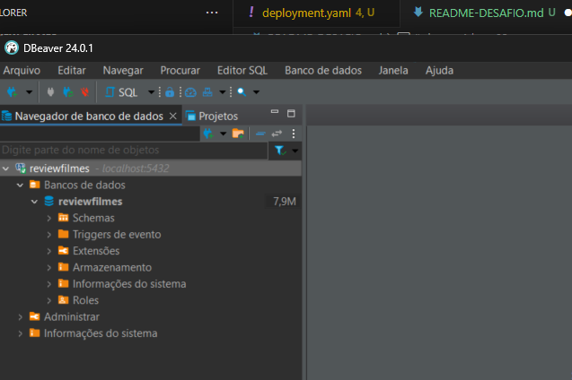
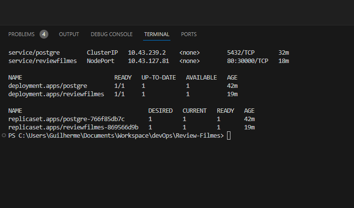
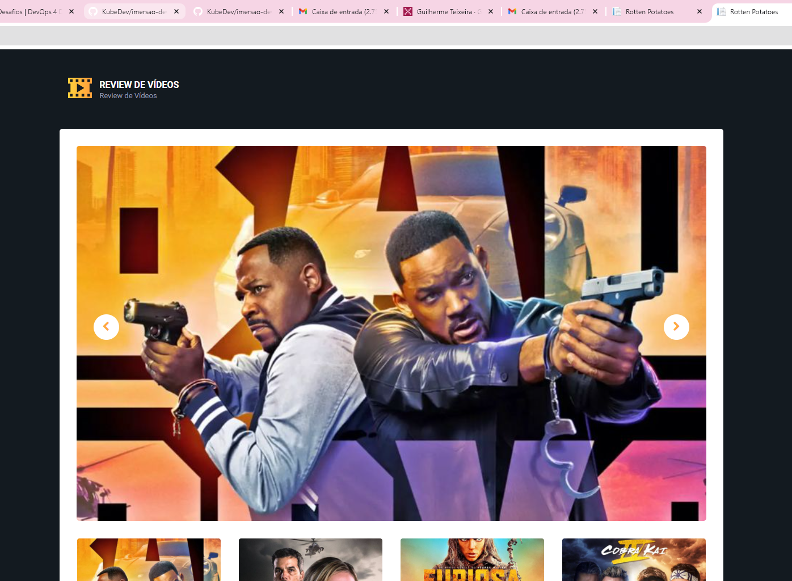
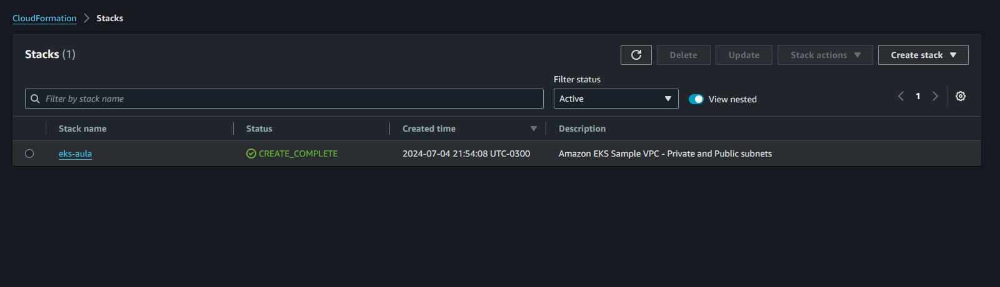
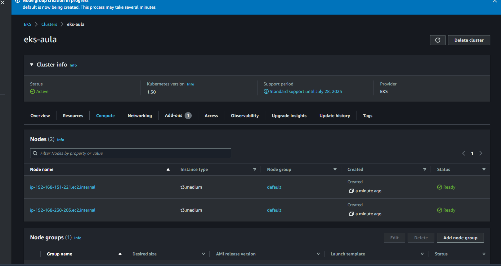
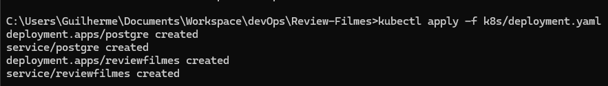
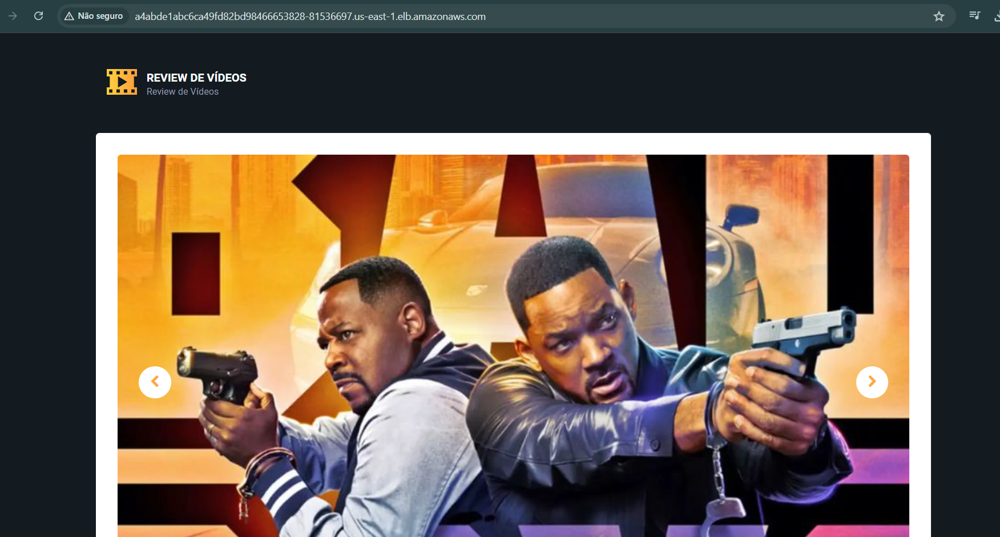

# devops4devs-02

Buildando e push da imagem da aplicação imagem pro dockerhub:
 - docker build -t gtrodrigues04/review-filmes:v1 -f src/Review-Filmes.Web/Dockerfile src/
 - docker push git@github.com:gtrodrigues04/Review-Filmes.git

Verificando recursos para configurar arquivo deployment.yaml:
 - kubectl api-resources
 
Aplicando configuração especificada no arquivo 
- kubectl apply -f k8s/deployment.yaml

Liberando acesso ao container do postgres e acessando no dbeaver:
 - kubectl port-forward service/postgre 5432:5432

 

 Serviços postgres e reviewfilmes em execução, pods postgres e reviewfilmes e replicasets

 

 Imagem da aplicação executando na porta 30000:
    

Desafio 2 

 Cluster criado na aws 
 

 

 deploy na aws:

 

 infos do cluster:

app executando na aws:

